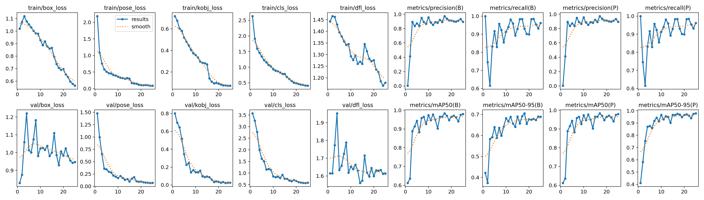
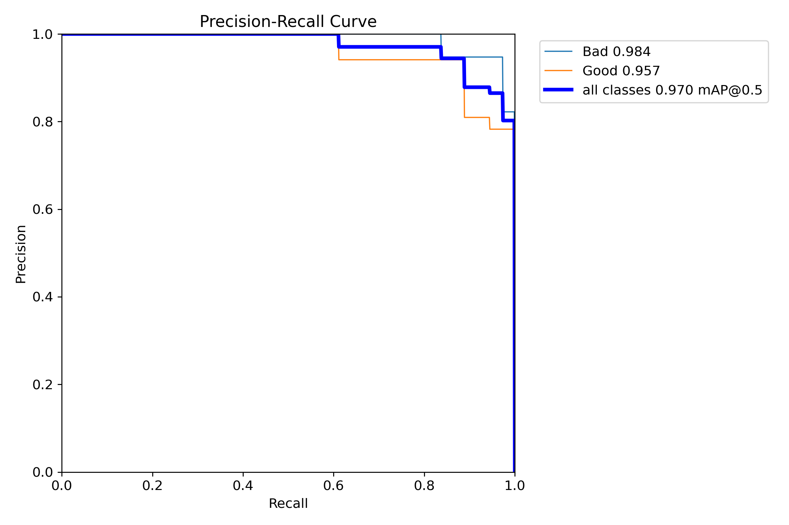
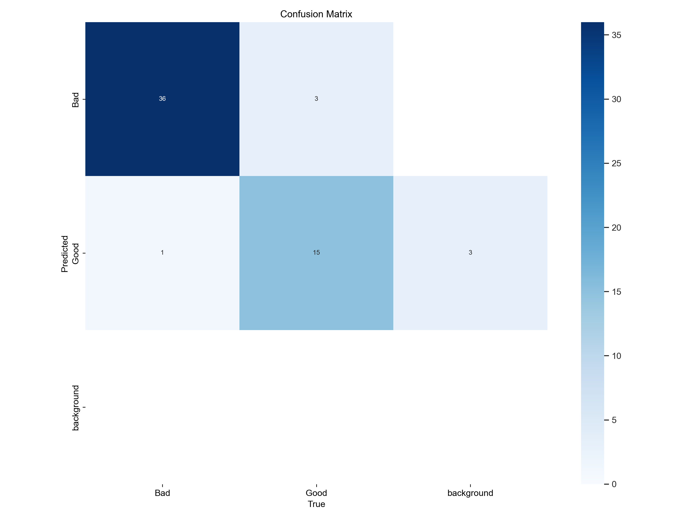
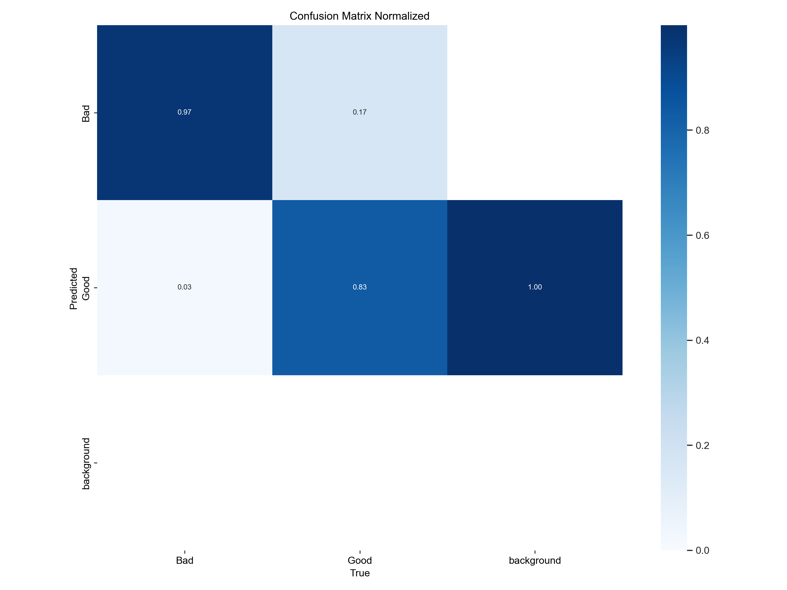
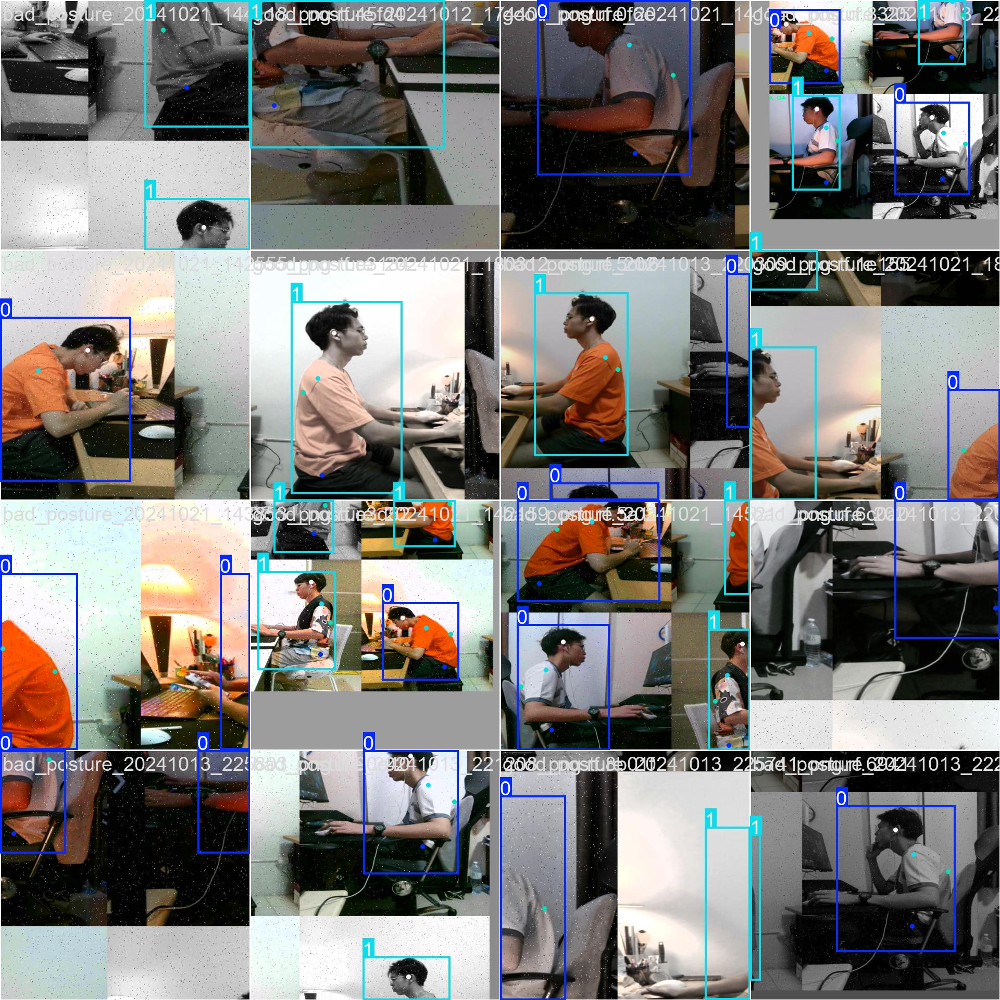
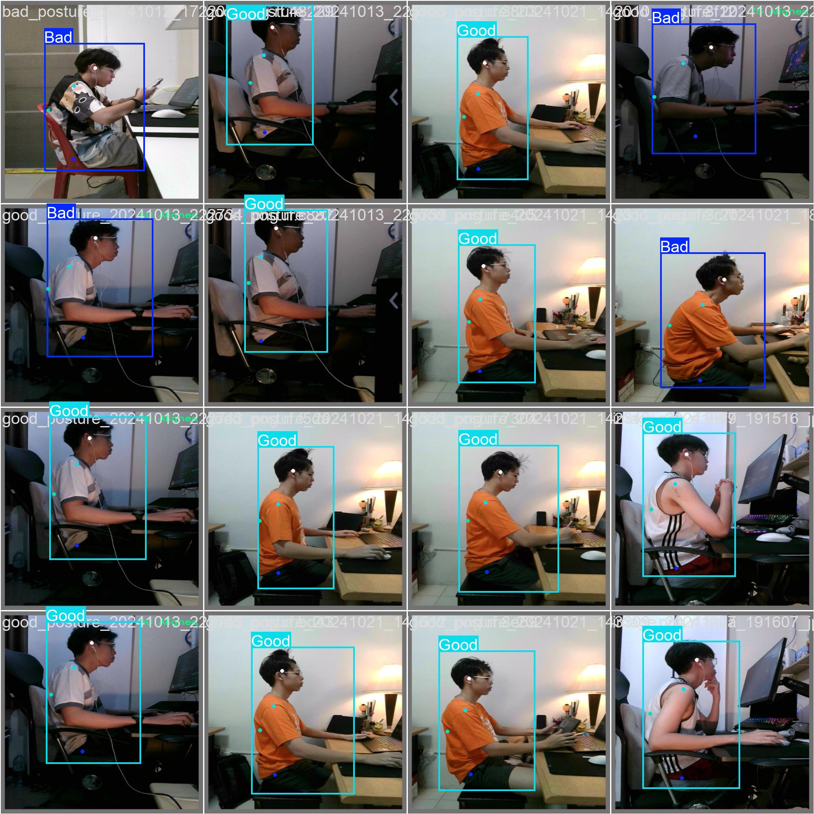
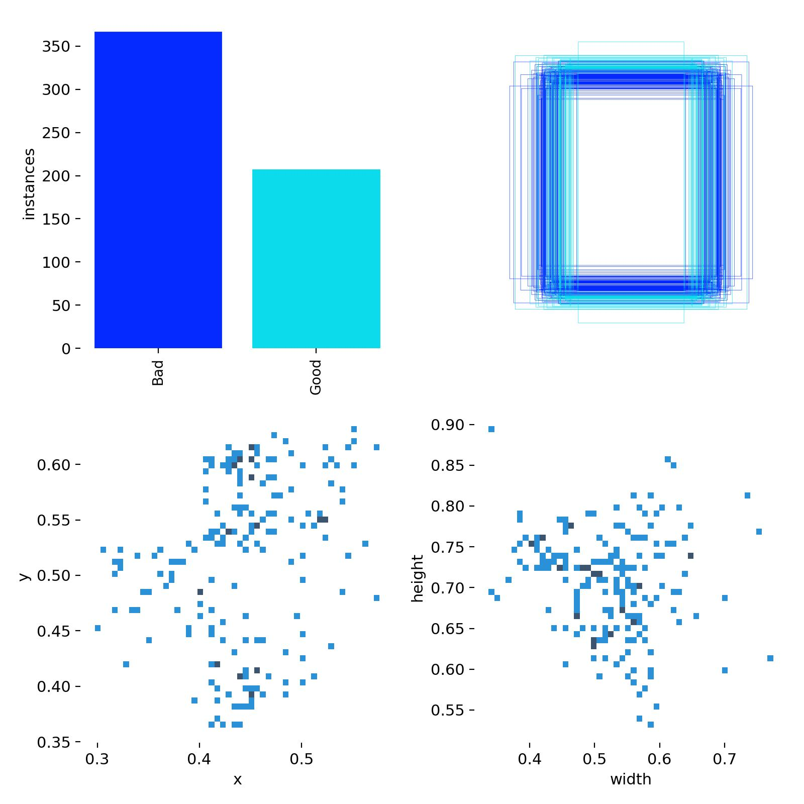

# PostureCoach 🤖

> **Model Training Complete** | **97.95% mAP Accuracy Achieved**

A real-time posture monitoring system powered by a highly accurate YOLOv8 pose estimation model that classifies user posture as "Good" or "Bad" from live camera input. Our trained model achieves exceptional 97.95% mAP@0.5 accuracy, making it production-ready for deployment on edge devices like Raspberry Pi.

## Project Overview

PostureCoach combines computer vision and edge computing to create an intelligent posture monitoring solution:

- **Real-time Analysis**: Uses YOLOv8 pose estimation for instant posture classification
- **Edge Computing**: Deployed on Raspberry Pi 4 for low-latency inference
- **Custom Training**: Model trained on a carefully labeled dataset of sitting postures
- **User-Friendly Interface**: Frontend application for configuring Raspberry Pi settings
- **Immediate Feedback**: Provides real-time alerts for poor posture

## Architecture

```
┌─────────────────┐    ┌─────────────────┐    ┌─────────────────┐
│   Camera Input  │───▶│  YOLOv8 Model   │───▶│  Posture Class  │
└─────────────────┘    └─────────────────┘    └─────────────────┘
                                │
                                ▼
┌─────────────────┐    ┌─────────────────┐    ┌─────────────────┐
│  Frontend UI    │◀───│  Raspberry Pi   │◀───│  Real-time      │
│  (Settings)     │    │  (Edge Device)  │    │  Feedback       │
└─────────────────┘    └─────────────────┘    └─────────────────┘
```

## Project Structure

```
PostureCoach/
├── client/                    # Frontend application for Pi configuration
├── server/                    # Backend services
├── pi/                        # Raspberry Pi specific code
├── models/                    # Trained YOLOv8 models
│   ├── best.pt               # Final trained PyTorch model
│   ├── best.onnx            # Optimized ONNX model for deployment
│   └── yolov8n-pose.pt      # Base YOLOv8 nano pose model
├── data/                      # Training dataset and configuration
│   ├── train/               # Training images and labels (573 images)
│   ├── valid/               # Validation images and labels (55 images)
│   ├── test/                # Test images and labels (27 images)
│   ├── data_abs.auto.yaml   # Dataset configuration file
│   └── README.dataset.txt   # Dataset documentation
├── training/                  # Model training utilities and results
│   ├── train.py            # Main training script
│   ├── test_inference.py   # Model inference testing
│   ├── test_webcam.py      # Webcam testing script
│   ├── train/              # Training outputs and metrics
│   └── util/               # Training utility scripts
├── docs/                      # Documentation and training results
│   └── training_results/   # Training curves, confusion matrices, examples
└── venv/                     # Python virtual environment
```

## Features

- **Real-time Posture Detection**: Instant classification of sitting posture
- **Edge Inference**: Low-latency processing on Raspberry Pi 4
- **Custom Model**: Trained specifically for sitting posture scenarios
- **Configurable Settings**: Web interface for system configuration
- **Dataset Management**: Tools for cleaning and organizing training data

## Development Status

### **Completed**

- [x] **Model Training**: YOLOv8 pose estimation model trained with excellent performance
- [x] **Dataset Preparation**: 655 images properly labeled with 4-keypoint annotations
- [x] **Model Optimization**: Achieved 97.95% mAP@0.5 for both detection and pose estimation
- [x] **Model Export**: Available in both PyTorch (.pt) and ONNX (.onnx) formats for deployment
- [x] **Performance Validation**: Comprehensive evaluation with multiple metrics

### **In Progress**

- [ ] Raspberry Pi deployment pipeline
- [ ] Real-time inference optimization for edge devices
- [ ] Frontend configuration interface
- [ ] User feedback and alert system
- [ ] Camera integration and calibration

### **Planned**

- [ ] Web-based companion app
- [ ] Data logging and analytics
- [ ] Advanced posture coaching features

## Model Performance Insights

### **Key Strengths**

1. **Outstanding Accuracy**: 97.95% mAP@0.5 demonstrates production-ready performance
2. **Excellent Generalization**: Consistent validation performance indicates robust learning
3. **Edge-Optimized**: YOLOv8n architecture perfect for Raspberry Pi deployment
4. **Dual-Task Excellence**: Superior performance in both person detection AND pose estimation
5. **Real-World Ready**: High recall (96.19%) ensures minimal missed detections

### **Technical Advantages**

- **Low False Positives**: 89.44% precision means reliable posture classifications
- **High Sensitivity**: 96.19% recall captures nearly all posture instances
- **Robust Keypoint Detection**: 97.85% pose mAP@0.5:0.95 shows precise keypoint localization
- **Fast Convergence**: Model reached peak performance by epoch 17
- **Stable Training**: Consistent loss reduction without overfitting

### **Deployment Readiness**

- **Model Size**: Nano architecture suitable for edge devices
- **Format Support**: ONNX export for optimized inference
- **Performance**: Exceeds typical production thresholds (>95% accuracy)
- **Robustness**: Validated on diverse posture scenarios

## Model Performance

Our YOLOv8-based PostureCoach model demonstrates exceptional performance with near state-of-the-art accuracy:

### **Final Model Metrics (25 Epochs)**

| Metric           | Box Detection | Pose Keypoints | Performance  |
| ---------------- | ------------- | -------------- | ------------ |
| **Precision**    | 89.44%        | 89.44%         | Excellent    |
| **Recall**       | 96.19%        | 96.19%         | Outstanding  |
| **mAP@0.5**      | 97.95%        | 97.95%         | Near Perfect |
| **mAP@0.5:0.95** | 68.88%        | 97.85%         | Exceptional  |
| **F1 Score**     | 92.69%        | 92.69%         | Excellent    |

### **Training Visualizations**

#### Training Curves

<div align="center">
  
  <p><em>Complete training metrics over 25 epochs</em></p>
</div>

#### Performance Curves

<div align="center">
  
  
  <p><em>Precision-Recall curves for Box Detection (left) and Pose Estimation (right)</em></p>
</div>

#### Confusion Matrices

<div align="center">
  
  
  <p><em>Model classification performance visualization</em></p>
</div>

#### Training Examples

<div align="center">
  
  <p><em>Sample training batch with ground truth annotations</em></p>
</div>

#### Validation Results

<div align="center">
  
  
  <p><em>Ground truth labels (left) vs Model predictions (right)</em></p>
</div>

### **Peak Performance**

- **Best Box mAP@0.5**: 98.34% (Epoch 17)
- **Best Pose mAP@0.5**: 98.34% (Epoch 17)
- **Best Precision**: 97.36% (Epoch 17)

### **Training Progress Summary**

| Epoch | Box mAP@0.5 | Pose mAP@0.5 | Precision | Recall | Train Loss | Val Loss |
| ----- | ----------- | ------------ | --------- | ------ | ---------- | -------- |
| 1     | 61.2%       | 61.2%        | 0.4%      | 100.0% | 1.020      | 0.829    |
| 5     | 94.3%       | 94.3%        | 87.2%     | 91.7%  | 1.055      | 1.014    |
| 10    | 97.3%       | 97.3%        | 95.7%     | 91.4%  | 0.928      | 1.024    |
| 15    | 96.6%       | 96.6%        | 92.1%     | 93.0%  | 0.866      | 1.000    |
| 20    | 96.5%       | 96.5%        | 91.3%     | 89.9%  | 0.697      | 0.982    |
| 25    | 97.9%       | 97.9%        | 89.4%     | 96.2%  | 0.563      | 0.947    |

_Training shows rapid convergence to high accuracy within first 10 epochs, with continued refinement through epoch 25_

### **Training Configuration**

- **Model**: YOLOv8n-pose (optimized for edge deployment)
- **Epochs**: 25 (well-converged)
- **Image Size**: 640×640 pixels
- **Batch Size**: 16
- **Classes**: Bad posture (0), Good posture (1)

## Dataset

The model is trained on a high-quality dataset of sitting postures with precise keypoint annotations:

- **Source**: [Sitting Posture Dataset](https://universe.roboflow.com/ikornproject/sitting-posture-rofqf) from Roboflow
- **License**: CC BY 4.0
- **Provider**: Roboflow user (ikornproject)
- **Format**: YOLO format with 4 keypoint annotations
- **Classes**: Good posture vs Bad posture
- **Total Images**: 655 images
- **Dataset Split**:
  - Training: 573 images (87.5%)
  - Validation: 55 images (8.4%)
  - Test: 27 images (4.1%)

### Dataset Structure

```
data/
├── train/          # 573 training images and labels
├── valid/          # 55 validation images and labels
├── test/           # 27 test images and labels
└── README.dataset.txt  # Dataset information
```

### Dataset Visualization

<div align="center">
  
  <p><em>Dataset label distribution and statistics</em></p>
</div>

## Technology Stack

- **Computer Vision**: YOLOv8 (Ultralytics)
- **Edge Computing**: Raspberry Pi 4
- **Frontend**: Web-based configuration interface
- **Backend**: Python-based inference server
- **Data Format**: YOLO format with keypoint annotations

## Quick Start

### Model Inference

Test the trained model on your own images:

```bash
cd PostureCoach/training
python test_inference.py
```

This will run inference on the validation dataset and save results with bounding boxes and keypoint annotations.

### Model Files

- `models/best.pt` - PyTorch model (for training/research)
- `models/best.onnx` - ONNX model (optimized for deployment)

## Requirements

- Raspberry Pi 4 (4GB+ RAM recommended)
- USB Camera or Pi Camera Module
- Python 3.8+
- YOLOv8 dependencies
- Web browser for configuration interface

## Installation

_Installation instructions will be added as the project develops_

## License

This project is currently in development. The dataset used for training is licensed under CC BY 4.0.

## Contributing

This project is in active development. Contributions and feedback are welcome!

## Contact

For questions or contributions, please open an issue in the project repository.

---

**Note**: This project is currently in development. Features and documentation will be updated as the project progresses.
